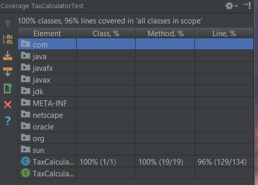

# Lab Writeup

Name: Joe Gilpin
Email: gilpinj@msoe.edu

## Final Code Coverage

## Analysis

Several lines of code were unreachable. On line 57, for example, it throws an exception for a
negative age entered. However, the method already checks for a negative age when it calls another
constructor, which calls setAge(). setAge() does throws the same exception as line 57, so there is
no way for the condition on line 56 to be true, allowing line 57 to execute. Similarly in the
isReturnRequired() method, a default is provided on line 188 for the switch statement. However,
the file type cannot reach default, because there are other checks in place to make sure that the
file type is valid. Besides this unreachable code, it is my belief that all other code was reached.
